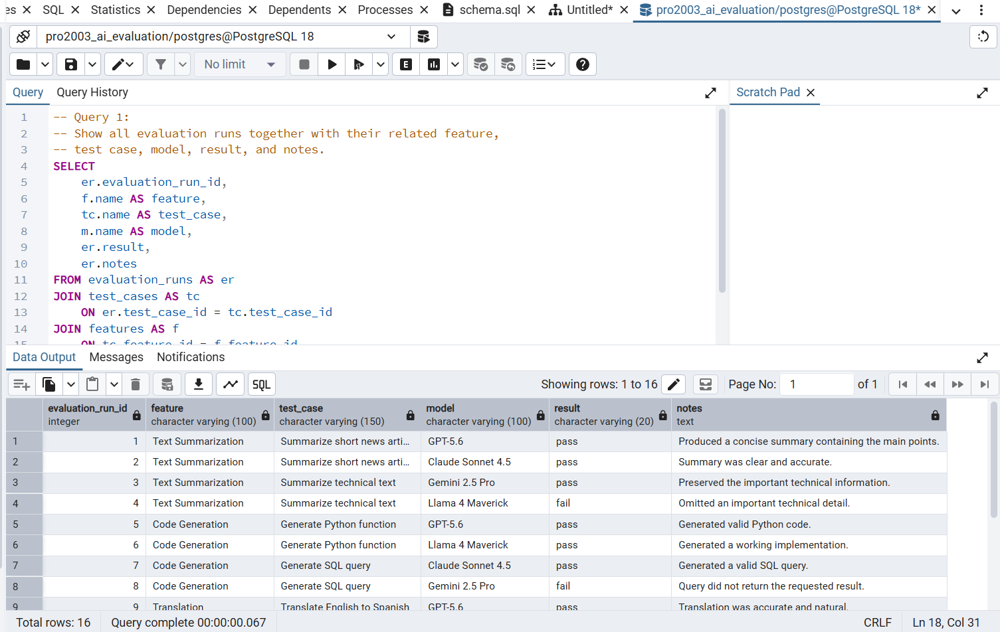
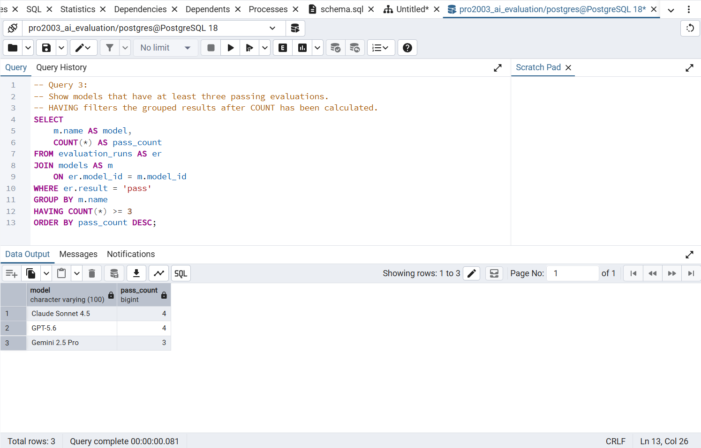
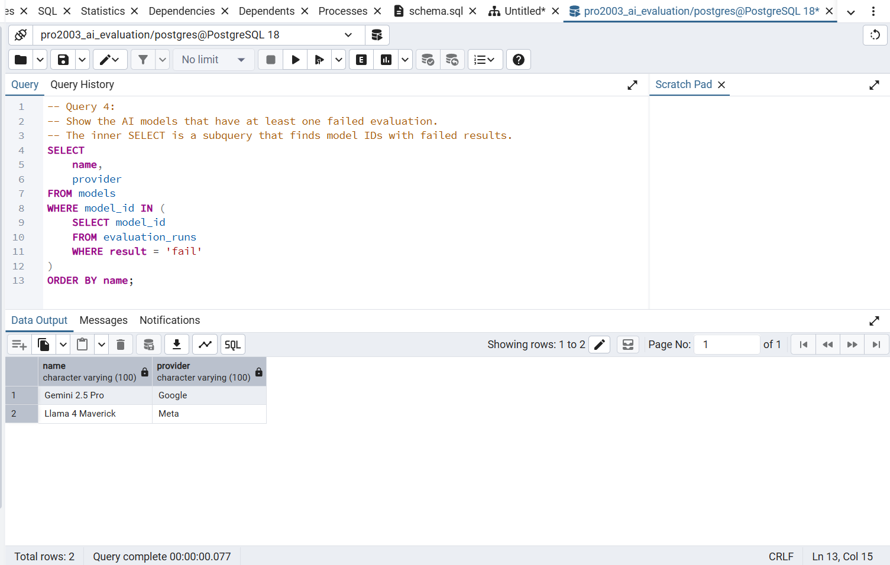
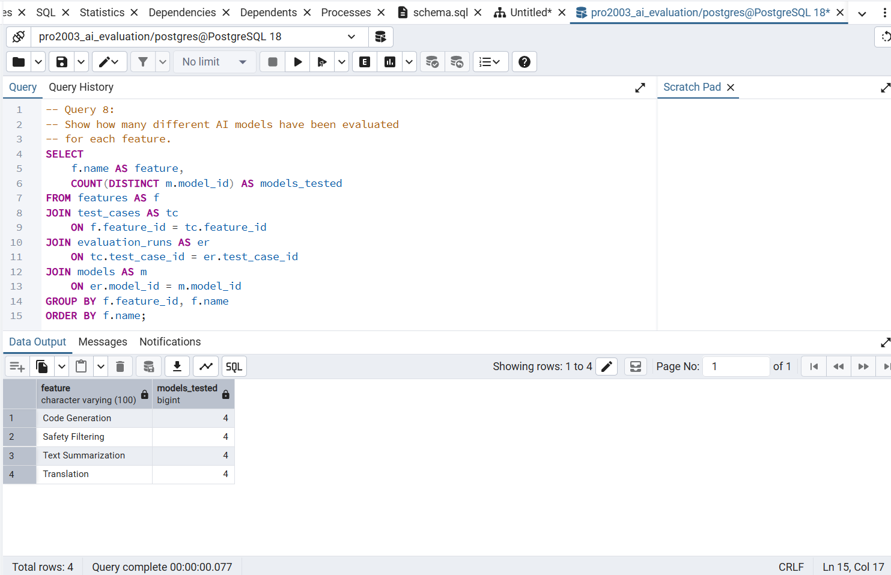

# PRO2003 Work Requirement 1
## AI Model Evaluation Database

### Domain

This project contains a small PostgreSQL database for evaluating AI models.

The database is designed to keep track of AI features, test cases, AI models, and evaluation runs. A feature can have several test cases, and each test case can be evaluated using different AI models.

### Database Design

The database contains four related tables:

- `features` – stores the AI features that are being tested.
- `test_cases` – stores individual test cases connected to a feature.
- `models` – stores the AI models used during evaluation.
- `evaluation_runs` – stores the result of running a model against a test case.

### Relationships

There is a one-to-many relationship between `features` and `test_cases`.

One feature can have many test cases, while each test case belongs to one feature.

There is also a many-to-many relationship between `test_cases` and `models`.

This relationship is resolved through the intermediate table `evaluation_runs`. Each evaluation run connects one test case with one model and stores the result of that evaluation.

### Keys and Constraints

Each table has a primary key.

Foreign keys are used to connect the tables:

- `test_cases.feature_id` references `features.feature_id`
- `evaluation_runs.test_case_id` references `test_cases.test_case_id`
- `evaluation_runs.model_id` references `models.model_id`

Required values use `NOT NULL`.

The `result` column in `evaluation_runs` uses a `CHECK` constraint so that only `pass` or `fail` can be stored.

### Files

- `schema.sql` contains the PostgreSQL DDL statements used to create the database.
- `er_model.png` contains the ER model using Crow's Foot relationships.
---

# PRO2003 Work Requirement 2

## Administer PostgreSQL Database

For Work Requirement 2, the database from Work Requirement 1 was populated with realistic test data and used to practice modifying, retrieving, combining, and analyzing relational data with SQL.

The work was completed using PostgreSQL 18 and pgAdmin 4.

## Test Data

The database was populated with data for:

- 4 AI features
- 8 test cases
- 4 AI models
- 16 evaluation runs

The test data contains different features, models, test cases, and both `pass` and `fail` evaluation results.

The file `populate_data.sql` contains the SQL statements used to populate the database.

## Data Modification

The file `modify_data.sql` demonstrates:

- `UPDATE`
- `DELETE FROM`

Before modifying or deleting data, the relevant rows were checked using `SELECT` statements.

## Queries

The file `queries.sql` contains eight documented `SELECT` queries.

The queries demonstrate:

- retrieving related data from multiple tables
- `JOIN ... ON`
- `LEFT JOIN`
- aggregate functions such as `COUNT`
- `COUNT(DISTINCT ...)`
- `GROUP BY`
- `HAVING`
- filtering with `WHERE`
- a subquery using `IN`

Each query includes SQL comments describing its purpose.

## Query Result Examples

### Query 1 – Joining related tables

This query combines evaluation runs with their related feature, test case, and AI model.

### Query 3 – GROUP BY and HAVING

This query counts passing evaluations for each model and uses `HAVING` to return models with at least three passing evaluations.

### Query 4 – Subquery

This query uses a subquery to find AI models that have at least one failed evaluation.

### Query 8 – COUNT DISTINCT

This query counts how many different AI models have been evaluated for each feature.

## Files

- `schema.sql` – creates the database tables and constraints
- `populate_data.sql` – inserts realistic test data
- `modify_data.sql` – demonstrates updating and deleting data
- `queries.sql` – contains eight documented SELECT queries
- `er_model.png` – ER model from Work Requirement 1
- `screenshots/` – screenshots showing selected query results